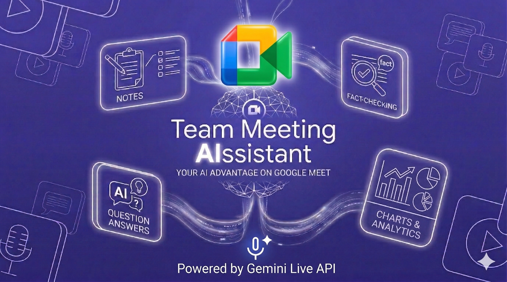
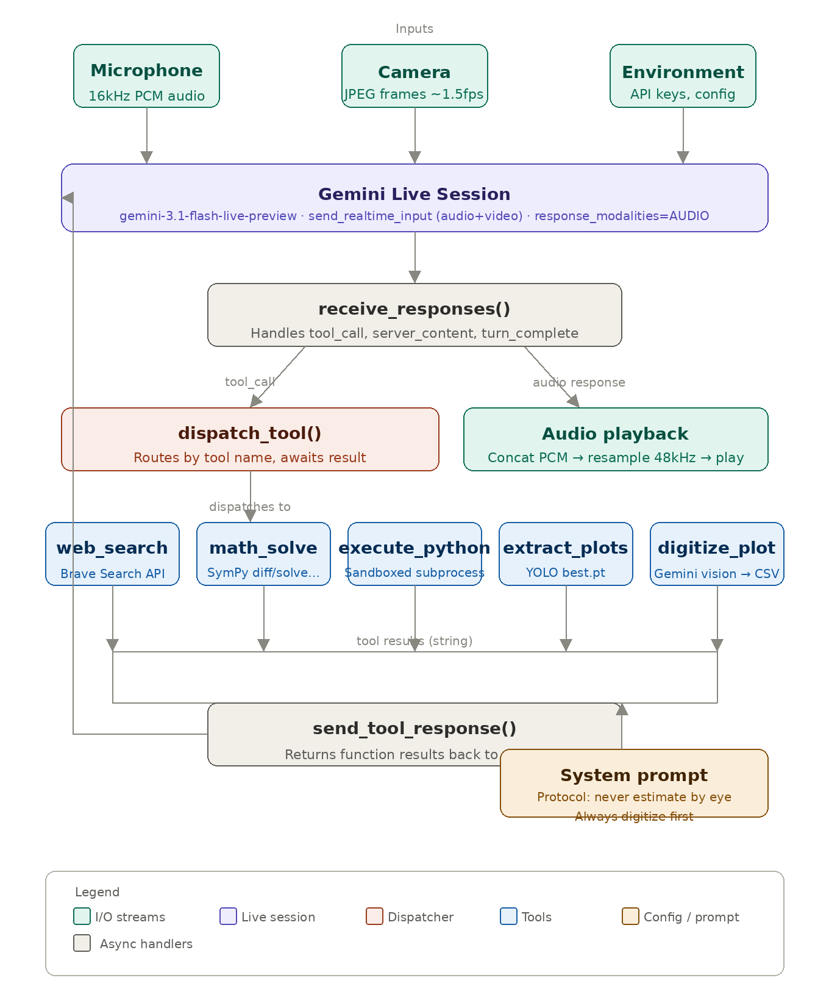
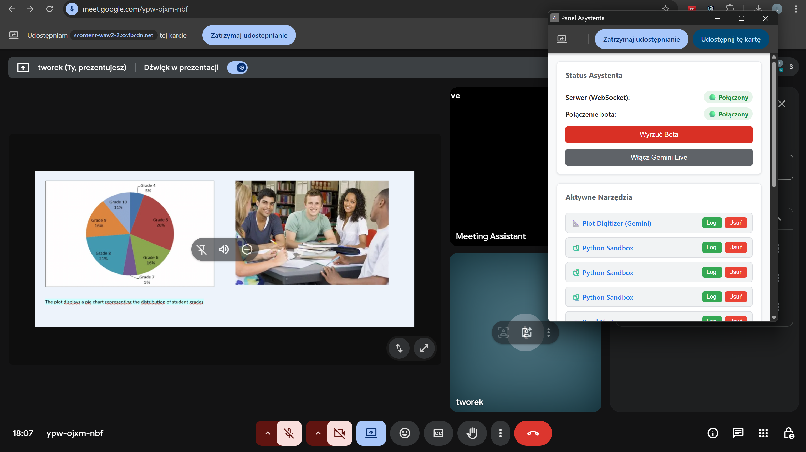
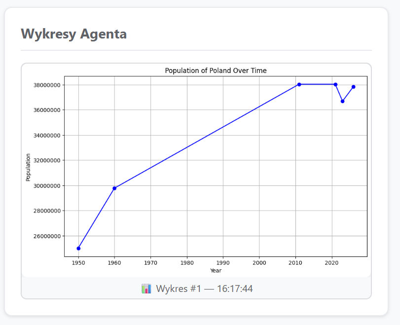
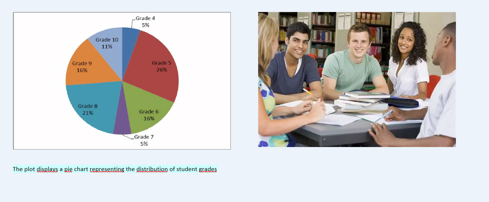
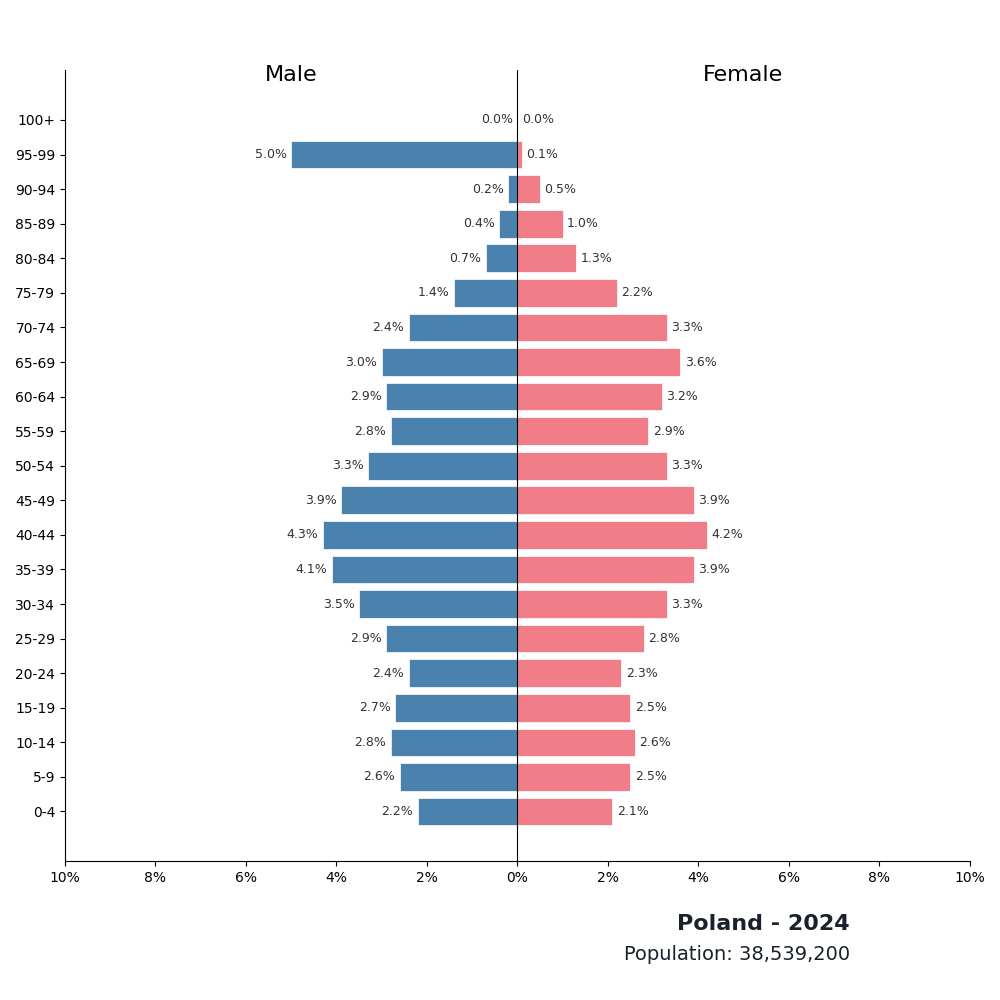

# **Introduction** 

We introduced this product to amplify the google meet experience. We combined Gemini Live API with Google Meet agents to 
create multi-functional conversational assistant that can actively participate in your calls, invoke external tools, and fact check.

When using Context Master, you can ask one of our agents to assist you during meetings, transforming your calls into actionable workspaces. The meaningful part is that the conent is visible for your whole team.

### Our agent is competent to:
- **Engage in Real-Time:** React to your queries, giving text or audio responses.
- **Transcribe and write up:** Transcribe the meeting for post-meeting briefing
- **Execute external tools:** Use the web search to fact check statements and displayed data and use tools for bloating and providing calculations.

You can control the agent using a dedicated panel, where you can configure and view the output of used tools.

Let's go over what our extension currently has to offer.



# Functionalities

In the extension panel, you can enable the agent to interact with your commands. 
You can use the agent for fact-checking, analysing and generating charts and voice assistance. 
Output generated by these tools is transmitted to the specified panel in the extension.

To have full control of the agents' reasoning, you are shared with logging of each tool in the extension panel. 

This allows you to get more precise results, for example a query after:
* ```Please generate me a chart of polish population between the years 2010-2022```

The agent may generate a chart with trimmed `y-scale` suggesting massive decrease, because of that you may ask it for the correction, to set `y-limits` from 0.

<p align="center">

</p>

On top of that, the agent is able to analyse webcam and shared content. Let's go over some examples.

First scenario:
<p align="center">

</p>
The model is asked to calculate the median of the grades displayed on the chart. It shows how the model digitalizes data and then runs a python script to find the median.

Second scenario:
<p align="center">

</p>
The model is asked to check if the data is correct. It shows how the model fact checks visual data.

Another functionality is for our model to summarize meetings in Google Docs. It summarizes the meeting based on transcribed audio it hears.

# Tech stack
### Frontend:
* **Chrome Extension API**: Frontend is developed in a form of a chrome extension.
* **Websockets**: to communicate with backend server we use websockets.

### Backend:
* **Python & FastAPI**: The prototype version uses FastAPI to manage connection with extension, bots and models.
* **Recall.ai API** We use the headless bot provider to transfer data between Google Meet and our project.
* **Google Docs API** to allow model to do write-ups.
* **Docker-Compose** For encapsulating backend.

### Models
* We use **Gemini Live API** with different tools for our agent.
* Another model is **YOLO**, which is used to extract data from presentations (pictures, graphs), so we can amplify the results of Gemini analysis.
* Instead of analysing charts directly, we use model to convert them to .csv tables. Gemini Live API is prompted to analise these datasets via python code.
# Installation
### Backend setup
1. Create a `.env` file in root backend directory and add your API keys:
```
RECALL_API_KEY=your_recall_token
GEMINI_API_KEY=your_gemini_key
WEBHOOK_BASE_URL=https://your-ngrok-domain.ngrok-free.app
```
2. To open up the server, use Docker:
```
docker-compose up
```
3. Expose your local port 8000 using ngrok
``` 
ngrok http 8000
```
### Frontend setup
1. Open Google Chrome and navigate to `chrome://extensions/`
2. Toggle Developer mode on in the top right corner.
3. Click Load unpacked and select the `extension` folder.
4. Ensure the extension is enabled and pin it to your browser toolbar.

The extension creates a panel which handles the connection, to reset connection just close and reopen the panel.